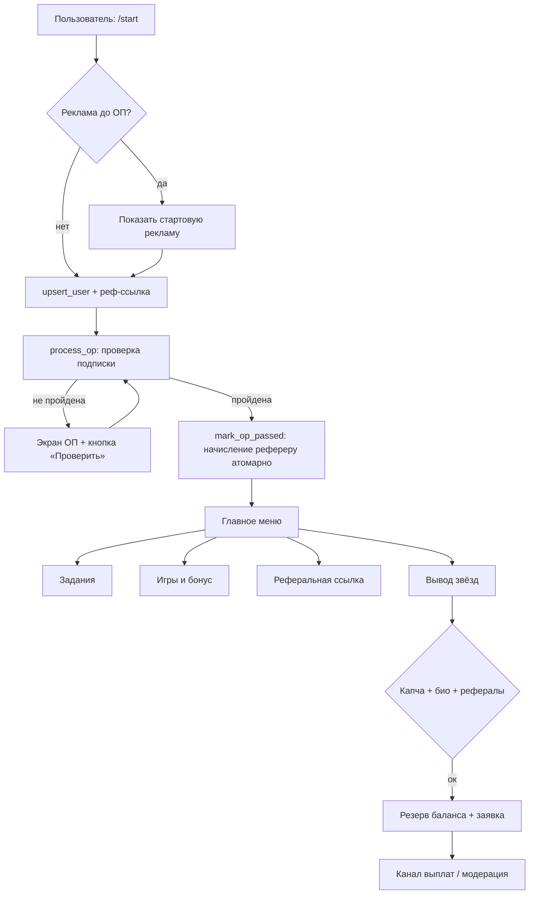

<div align="center">

# ⭐ RefStars Bot

**Telegram-бот для заработка звёзд: рефералы, задания, игры и вывод подарками.**
Один файл, `aiogram 3`, SQLite, продакшен-готовая архитектура.


</div>

---

## 📋 Содержание

- [Что это](#-что-это)
- [Возможности](#-возможности)
- [Архитектура](#-архитектура)
- [Требования](#-требования)
- [Быстрый старт](#-быстрый-старт)
- [Конфигурация](#-конфигурация)
- [Провайдеры монетизации](#-провайдеры-монетизации)
- [Деплой](#-деплой)
- [Структура проекта](#-структура-проекта)
- [Качество кода и что было исправлено](#-качество-кода-и-что-было-исправлено)
- [Безопасность](#-безопасность)
- [FAQ](#-faq)
- [Лицензия и дисклеймер](#-лицензия-и-дисклеймер)

---

## 🎯 Что это

**RefStars** — это монолитный (один `.py`-файл) Telegram-бот на `aiogram 3`, реализующий
полноценную «звёздную» механику: пользователь проходит обязательную подписку (ОП),
приглашает друзей, выполняет задания, играет в мини-игры на встроенных кубиках Telegram,
копит внутреннюю валюту и выводит её подарками.

Весь функционал управляется через **админ-панель прямо в Telegram** (`/admin`): тексты,
награды, лимиты, провайдеры, каналы выплат — без правки кода и без перезапуска.
Настройки хранятся в базе и применяются «на лету».

> Бот рассчитан на запуск из коробки даже на слабом железе (включая Termux на Android)
> и не требует PostgreSQL — используется SQLite в режиме WAL с аккуратной настройкой PRAGMA.

---

## ✨ Возможности

### 💸 Экономика и рефералы
- Реферальная система с наградой за каждого приглашённого, **прошедшего ОП**.
- Защита от само-реферала и фиксация пригласившего «первый — навсегда» (нельзя переписать).
- Внутренняя валюта в **минорных единицах (целые числа)** + `Decimal`-арифметика — никаких ошибок округления float.
- Ежедневный бонус, промокоды (`/promo`), активируемые «чеки» по deep-link.

### 🔐 Обязательная подписка (ОП)
- Несколько провайдеров ОП с **каскадным фолбэком** и **circuit breaker** при сбоях.
- Периодическая **переспроверка** подписки (настраиваемый интервал).
- Режим **fail-open**: если внешний сервис лёг, пользователя не блокируют из-за чужого сбоя.
- Собственные ресурсы ОП (свои каналы) с проверкой членства, заявок на вступление и событий `chat_member`.

### 🎁 Вывод средств
- Выбор подарка из преднастроенного списка (сердце, мишка, торт, кубок, алмаз и т.д.).
- **Атомарное резервирование баланса** — двойной вывод и «старые» колбэки исключены.
- **Автовозврат средств** при отклонении заявки.
- Анти-фрод перед выводом: математическая капча, проверка реф-ссылки в поле «О себе», минимум рефералов.
- Канал выплат в двух режимах: модерация или авто-публикация; массовое отклонение заявок.

### 💎 Задания и игры
- Задания, ротируемые между провайдерами; пропуск, проверка, фиксированные/авто-награды.
- Мини-игры на **нативных кубиках Telegram**: кубик 🎲, баскетбол 🏀, боулинг 🎳, слоты 🎰.
- Ставки с пресетами и **восстановление незавершённых раундов** после рестарта.

### 🛠 Администрирование
- Полная админка в Telegram: пользователи, баланс, бан, сброс ОП/заданий, статистика.
- UTM/source-трекинг переходов, рассылки, диагностика и логи провайдеров.
- Системные инструменты: оптимизация БД, очистка логов, сброс кэшей, перезапуск процесса.

### ⚙️ Надёжность
- **Однопроцессная блокировка** (защита от двойного запуска).
- **Ротация логов** в файл (5 МБ × 5).
- Рантайм-кэши с авто-очисткой, фоновые задачи с трекингом, глобальный обработчик ошибок.
- **Автомиграции схемы** БД при старте (совместимость со старыми базами, переход на минорные единицы).
- Проверка версий зависимостей перед стартом с понятной ошибкой вместо падения.

---

## 🏗 Архитектура



**Технические решения:**

| Слой | Реализация |
|------|-----------|
| Транспорт | `aiogram 3`, long polling, отдельные роутеры для пользователя и админа |
| Middleware | `Performance` (логирование медленных операций), `Ban`, `FreshOp` (свежесть ОП) |
| Хранилище | SQLite (WAL, `synchronous=NORMAL`, `foreign_keys=ON`), короткоживущие соединения |
| Деньги | целочисленные минорные единицы + `Decimal`, fallback на старые REAL-колонки |
| FSM | собственное персистентное хранилище состояний в SQLite (`SQLiteFSMStorage`) |
| HTTP | переиспользуемая `aiohttp`-сессия, ретраи и circuit breaker для провайдеров |
| Конфиг | `DEFAULT_SETTINGS` в коде → переопределение в БД → правка в админке без рестарта |

---

## 📦 Требования

- **Python 3.10+** (протестировано вплоть до 3.13, в т.ч. в Termux).
- Зависимости (см. [`requirements.txt`](requirements.txt)):

```
aiogram>=3.20,<4
aiohttp>=3.9
aiosqlite>=0.19
python-dotenv>=1.0
```

Бот сам проверяет версии при запуске и, если что-то не так, выдаёт точную инструкцию по установке вместо невнятной ошибки.

---

## 🚀 Быстрый старт

```bash
# 1. Клонируем репозиторий
git clone https://github.com/<your-username>/refstars-bot.git
cd refstars-bot

# 2. Виртуальное окружение (рекомендуется)
python3 -m venv .venv
source .venv/bin/activate          # Windows: .venv\Scripts\activate

# 3. Зависимости
pip install -r requirements.txt

# 4. Конфигурация
cp .env.example .env
# откройте .env и впишите BOT_TOKEN и ADMIN_IDS

# 5. Запуск
python refstars_bot_v49_op_referral_fix.py
```

После старта откройте бота в Telegram, отправьте `/start`, затем `/admin` — и настройте
тексты, награды и провайдеров через панель. База данных и логи создадутся автоматически.

---

## ⚙️ Конфигурация

Конфигурация двухуровневая:

1. **`.env`** — секреты и параметры первого запуска (см. [`.env.example`](.env.example)).
2. **Админ-панель `/admin`** — всё остальное (десятки настроек), хранится в БД и меняется без перезапуска.

### Минимальный `.env`

```env
BOT_TOKEN=123456789:AA...your-token...
ADMIN_IDS=123456789,987654321
DB_PATH=bot.db
```

### Ключевые переменные окружения

| Переменная | Назначение | По умолчанию |
|-----------|-----------|--------------|
| `BOT_TOKEN` | Токен от @BotFather (нужен для первого запуска) | — |
| `ADMIN_IDS` | ID администраторов через запятую | — |
| `DB_PATH` | Путь к файлу SQLite | `bot.db` |
| `LOG_LEVEL` | Уровень логов: `DEBUG`/`INFO`/`WARNING`/`ERROR` | `INFO` |
| `LOG_FILE` | Файл логов с ротацией (`0`/`off` — отключить) | `bot.log` |
| `SINGLE_INSTANCE_LOCK` | Защита от двойного запуска | `1` |
| `DELETE_WEBHOOK_ON_START` | Снять webhook перед polling | `1` |
| `OP_FAIL_OPEN_ON_PROVIDER_ERROR` | Пропускать при сбое провайдера ОП | `1` |
| `CUSTOM_OP_FAIL_OPEN_ON_RESOURCE_ERROR` | То же для своих ресурсов ОП | `1` |
| `PAYOUT_CHANNEL_CHAT_ID` | Канал/чат уведомлений о выплатах | — |
| `*_API_KEY` / `*_TOKEN` | Ключи провайдеров (опционально) | — |

> Любой API-ключ можно ввести и в админке (раздел «API») — `.env` для них необязателен.

---

## 🔌 Провайдеры монетизации

Бот умеет работать сразу с несколькими внешними сервисами. Каждый **опционален** — подключайте
только нужные. Роль провайдера (`op` / `tasks` / `both`) и режим выбора (`auto`/конкретный/`mix`)
настраиваются в админке.

| Провайдер | Роль | Переменная окружения |
|-----------|------|----------------------|
| **SubGram** | Обязательная подписка | `SUBGRAM_API_KEY` |
| **Botohub** | Задания | `BOTOHUB_TOKEN` |
| **Botohub Views** | Рекламные просмотры | `BOTOHUB_VIEWS_TOKEN` |
| **PiarFlow** | Задания | `PIARFLOW_API_KEY` |
| **TGRASS** | Задания | `TGRASS_API_KEY` |
| **Trafsly** | Задания | `TRAFSLY_API_KEY` |
| **DarkBoost** | ОП и задания | `DARKBOOST_API_KEY` |
| **HiViews** | Рекламные просмотры | `HIVIEWS_API_KEY` |

Дополнительно поддерживаются **собственные ресурсы ОП** — ваши каналы/чаты, в которых членство
проверяется напрямую через Telegram API (без сторонних сервисов).

---

## 🌐 Деплой

### systemd (Linux-сервер)

Создайте `/etc/systemd/system/refstars.service`:

```ini
[Unit]
Description=RefStars Telegram Bot
After=network-online.target
Wants=network-online.target

[Service]
Type=simple
User=refstars
WorkingDirectory=/opt/refstars-bot
ExecStart=/opt/refstars-bot/.venv/bin/python /opt/refstars-bot/refstars_bot_v49_op_referral_fix.py
Restart=always
RestartSec=5

[Install]
WantedBy=multi-user.target
```

```bash
sudo systemctl daemon-reload
sudo systemctl enable --now refstars
sudo journalctl -u refstars -f      # логи
```

### Termux (Android)

```bash
pkg update && pkg install python git
git clone https://github.com/<your-username>/refstars-bot.git
cd refstars-bot
pip install -r requirements.txt
cp .env.example .env && nano .env
python refstars_bot_v49_op_referral_fix.py
```

> Бот специально совместим с Python 3.13/Termux: соединения с SQLite не переоткрываются
> повторно (обёртка `DBContext`), что исключает ошибку `threads can only be started once`.

---

## 📁 Структура проекта

```
refstars-bot/
├── refstars_bot_v49_op_referral_fix.py   # весь бот (один файл)
├── requirements.txt                       # зависимости
├── .env.example                           # шаблон конфигурации
├── .gitignore                             # исключения для Git
└── README.md                              # этот файл
```

Артефакты, создаваемые во время работы (в Git **не** попадают):

```
bot.db, bot.db-wal, bot.db-shm   # база данных SQLite (WAL)
bot.log                          # ротируемые логи
bot.lock                         # файл однопроцессной блокировки
.env                             # ваши секреты
```

---

## 🧹 Качество кода и что было исправлено

Базовая версия уже написана на высоком уровне: транзакции `BEGIN IMMEDIATE` со страховкой по
`rowcount` во всех денежных операциях, отсутствие SQL-инъекций (динамические имена только из
жёстких allow-list и зажатых числовых PRAGMA), корректная `Decimal`-арифметика и грамотная
защита от гонок и двойных начислений. Статический анализ (`pyflakes`) не выявил неиспользуемых
импортов или необъявленных имён.

В рамках доработки внесены **точечные** улучшения (без переписывания рабочей логики):

- 🐛 **Висячая задача `asyncio`.** Перезапуск процесса из админки запускался «голым»
  `asyncio.create_task(...)`, на который не сохранялась ссылка (риск сборки мусора до завершения).
  Переведён на уже существующий безопасный помощник `create_background_task()`, который хранит
  ссылку и логирует ошибки.
- 🧼 **Переменная цикла.** В `game_bet_presets()` переменная цикла переопределялась внутри тела
  (`for part ... part = ...`); переименована для читаемости, поведение не изменилось.

Изменения минимальны и сохраняют полную обратную совместимость с существующими базами и настройками.

### Проверки перед коммитом

```bash
python -m pyflakes refstars_bot_v49_op_referral_fix.py     # быстрый поиск ошибок
python -m ruff check --select=F,B,ASYNC refstars_bot_v49_op_referral_fix.py
python -c "import ast; ast.parse(open('refstars_bot_v49_op_referral_fix.py', encoding='utf-8').read())"
```

---

## 🔒 Безопасность

- **Никогда не коммитьте `.env`** — он в `.gitignore`. Если токен утёк, перевыпустите его у @BotFather.
- Перед публикацией репозитория убедитесь, что в коде/настройках нет реальных API-ключей
  (в `DEFAULT_SETTINGS` все ключи берутся из окружения и по умолчанию пустые).
- Файлы базы (`*.db*`) и логи могут содержать персональные данные пользователей — не выкладывайте их.
- Команды администратора доступны только ID из `ADMIN_IDS`; держите этот список в секрете.
- Однопроцессная блокировка защищает от случайного двойного запуска и конфликтов polling.

---

## ❓ FAQ

**Можно ли сменить токен без правки `.env`?**
Да. В админке есть настройка `bot_token`; новое значение применится после перезапуска процесса.

**Обязательно ли подключать все провайдеры?**
Нет. Все интеграции опциональны. Можно работать только на собственных ресурсах ОП или включить лишь часть сервисов.

**Почему деньги хранятся целыми числами?**
Это минорные единицы (как «копейки»). Целочисленная арифметика + `Decimal` исключают ошибки округления float, типичные для денежных расчётов.

**Бот падает с сообщением о версии библиотеки.**
Это намеренная проверка зависимостей при старте. Установите версии из `requirements.txt`:
`pip install -r requirements.txt`.

**Где менять тексты и награды?**
Всё в админ-панели `/admin` → соответствующие разделы. Перезапуск не нужен.

**Как переключиться на webhook вместо polling?**
Текущая версия использует long polling. Для webhook потребуется доработка точки входа `main()`.

---

## 🤝 Вклад

PR и issue приветствуются. Перед отправкой изменений:

1. Прогоните `pyflakes` и `ruff` (см. выше) — без новых предупреждений категорий `F`/`B`/`ASYNC`.
2. Сохраняйте денежную логику атомарной (`BEGIN IMMEDIATE` + проверка `rowcount`).
3. Не добавляйте секреты в код — только через переменные окружения/настройки.

---

## 📄 Лицензия и дисклеймер

Рекомендуемая лицензия — **MIT**. Добавьте файл `LICENSE` с выбранной лицензией
(репозиторий поставляется без неё, чтобы вы могли выбрать сами).

> **Дисклеймер.** Проект предоставляется «как есть», в образовательных целях. Перед запуском
> убедитесь, что ваша схема (обязательные подписки, рекламные показы, вознаграждения) соответствует
> [Условиям использования Telegram](https://telegram.org/tos), правилам Bot API и требованиям
> подключённых рекламных сетей и партнёров, а также законодательству вашей юрисдикции. Авторы и
> контрибьюторы не несут ответственности за неправомерное использование.

---

<div align="center">

Сделано с ⭐ на `aiogram 3`

</div>
